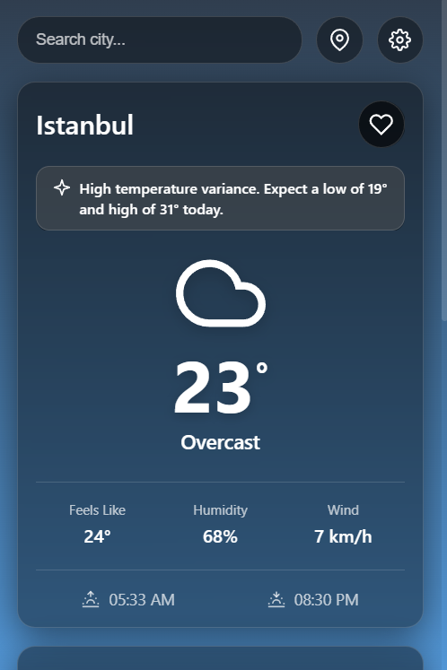
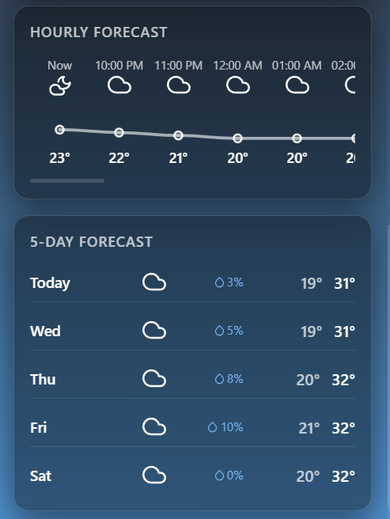

# SkyCast - Premium Weather Extension V2.0 🌤️

A beautiful, highly interactive, and privacy-friendly Chrome Extension that delivers real-time weather forecasts, smart AI-like summaries, and interactive charts right in your browser. Built entirely with Vanilla JavaScript and zero external dependencies.

  
  

## ✨ Features

- **🎨 Premium UI/UX:** A stunning glassmorphism design with dynamic, physics-based weather animations (rain, snow, clouds, starry night) that react to current weather conditions.
- **📍 Smart Auto-Location:** Instantly detects your location via GPS (or IP fallback) and remembers your last viewed city seamlessly.
- **📈 Interactive Hourly Chart:** A smooth, draggable SVG chart displaying hourly temperature variations.
- **🤖 Smart Summaries:** Generates human-readable, AI-style daily weather summaries (e.g., "Rain expected today, don't forget your umbrella").
- **🌍 Multi-Language Support:** Fully translated in both English and Turkish.
- **🌙 Dynamic Sun Arc:** Visually tracks the sun's position between sunrise and sunset based on your selected city's local time.
- **⭐ Favorites System:** Search and save your favorite cities with a single click for quick access.
- **🔑 Zero API Keys Required:** Uses open and free APIs (Open-Meteo, GeoJS). No sign-ups, no rate-limiting headaches, ready to use out of the box!
- **⚡ Manifest V3 Ready:** Built with the latest Chrome extension standards, utilizing service workers for reliable background temperature badge updates.

## 🚀 Installation

Since this extension requires no build tools or package managers, installing it is incredibly simple:

1. Clone this repository or download the ZIP file and extract it.
2. Open your Google Chrome browser and navigate to `chrome://extensions/`.
3. Enable **"Developer mode"** in the top right corner.
4. Click on the **"Load unpacked"** button.
5. Select the `weather-extension` folder.
6. Pin the extension to your toolbar and enjoy!

## 🛠️ Technologies Used

- **HTML5 & CSS3:** For structure and stunning visual styling (Glassmorphism, custom CSS variables, responsive design).
- **Vanilla JavaScript (ES6+):** Complete logic handled without any bloated frameworks like React or Vue.
- **Chrome Extension API:** For storage, alarms, messaging, and action badges (Manifest V3).
- **[Open-Meteo API](https://open-meteo.com/):** For highly accurate, free weather data and geocoding without API keys.
- **[GeoJS API](https://www.geojs.io/):** For reliable IP-based location fallback when GPS is unavailable.

## 💡 How It Works

The extension utilizes Chrome's Local Storage to cache settings and locations to provide an instant, zero-load-time experience when you open the popup. The background service worker wakes up periodically to fetch the latest temperature of your active city and updates the tiny extension badge on your browser toolbar silently.
